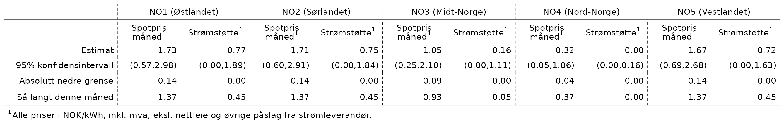
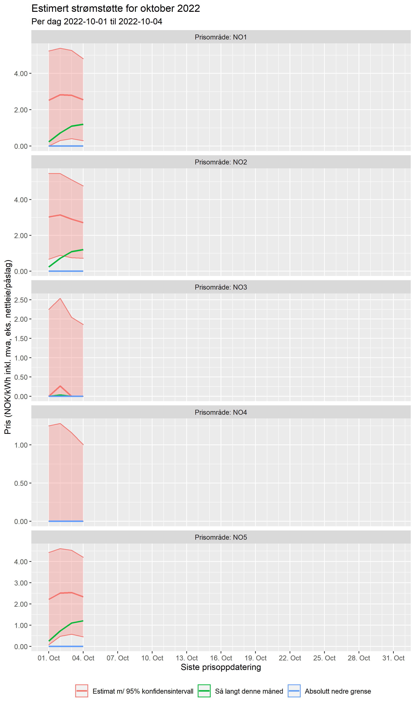
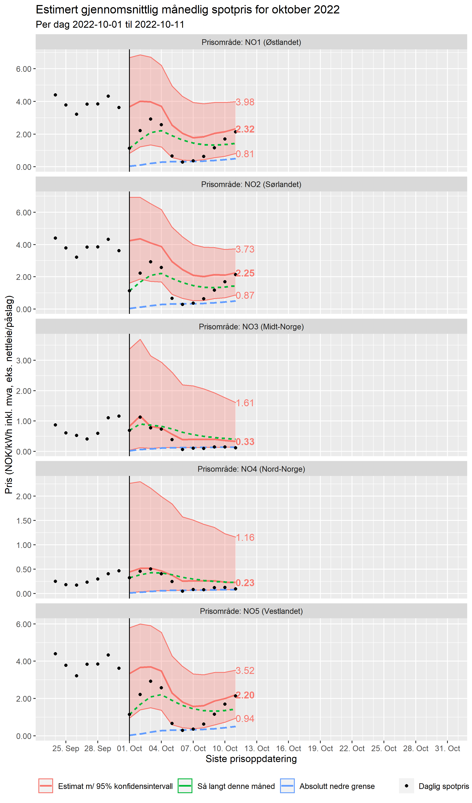

```{r, include = FALSE}
knitr::opts_chunk$set(
  collapse = TRUE,
  comment = "#>",
  fig.path = "man/figures/README-",
  out.width = "200%"
)
```

# Estimering av strømstøtte

## Bakgrunn

Statens strømstøtteordning gir en støtte til husholdninger basert på gjennomsnittlig spotpris og forbruk for hele måneden. 
Ordning tar ikke hensyn til spotprisen når man faktisk bruker strøm. Hvor mye man får i støtte vet man heller ikke før måneden er over. 
Med andre ord vet man ikke nøyaktig hvor mye man i praksis må betale for strømmen når man bruker den. Når måneden nærmer seg slutten har man en viss anelse om omtrent hvor stor strømstøtten blir, men hvor stor er usikkerheten? Og hvor tror vi strømstøtten ender i starten av måneden?

I et forsøk på å si noe om dette har jeg estimert den gjennomsnittlige spotprisen for måneden gjennom å modellere og predikere daglig spotpris hvert område. Dette gir et estimat på strømstøtten med usikkerhetsintervaller.

## Estimater

```{r tabell, echo=FALSE, fig.cap="Siste estimerte priser per område", out.width = '100%'}

```

```{r fig-kompensasjon, echo=FALSE, fig.cap="Estimert kompensasjon per område per dag", out.width = '100%'}

```

```{r fig-snittpris, echo=FALSE, fig.cap="Estimerte gjennomsnittspriser per område per dag", out.width = '100%'}

```

## Metode (for spesielt interesserte)

[MJ: Legg inn detaljer om hvordan jeg har kommet frem til estimater og konfidensintervaller her.]
